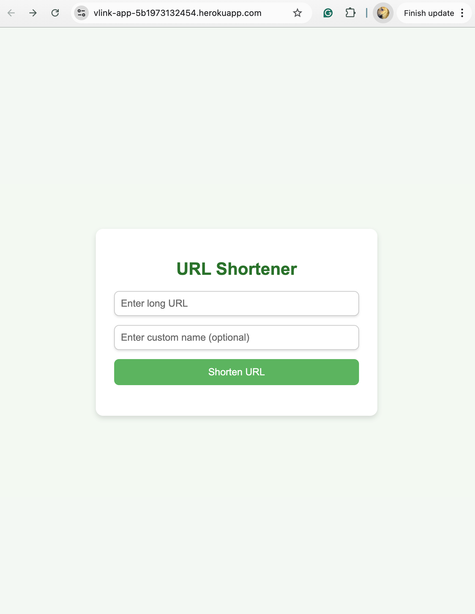
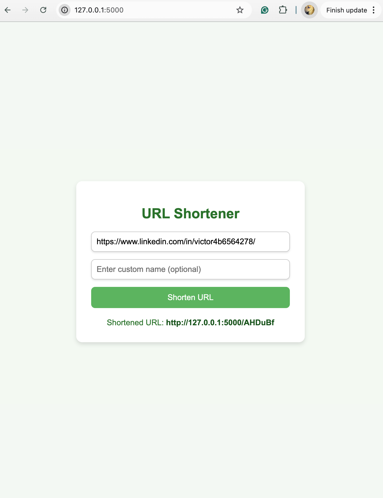
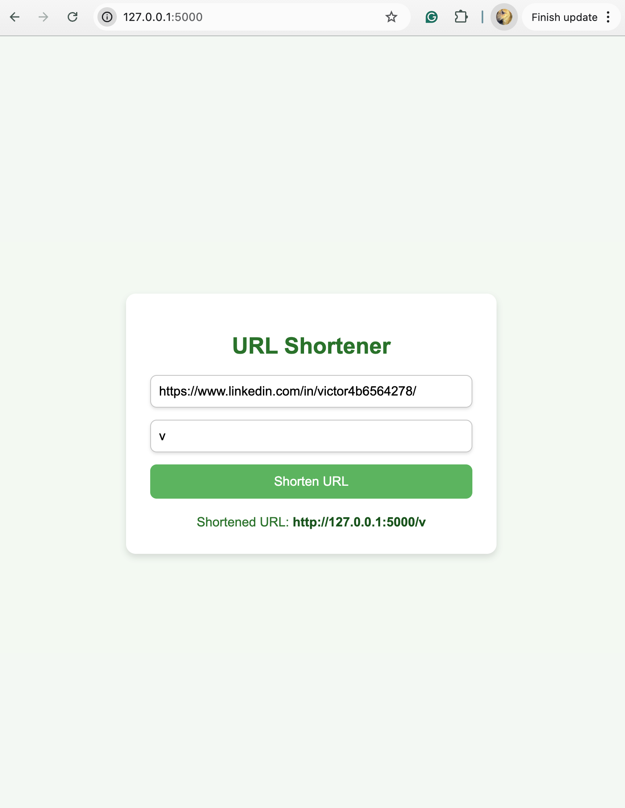
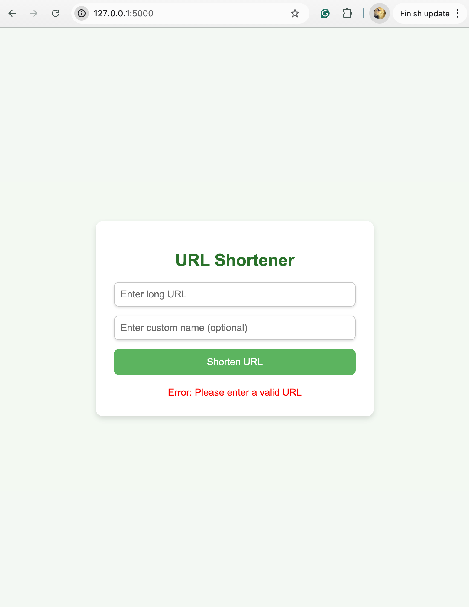

# URL Shortener  

A simple and customizable URL Shortener built using Flask and PostgreSQL. Create short links for long URLs with an option to customize the shortened URL.  

## Features  
- Shortens any long URL to a simple, user-friendly URL.  
- Allows users to provide an optional custom name.  
- Automatically generates a random short name if no custom name is provided.  
- Redirects users from the short URL to the original long URL.  

## Technologies Used  
- **Backend**: Flask (Python)  
- **Database**: PostgreSQL  
- **Frontend**: HTML/CSS (Bootstrap for styling)  
- **Deployment**: Local development environment (Heroku-ready)  

## Project Structure
.
└── python/
    │-- Procfile            # Heroku configuration
    │-- app.py              # Main Flask application
    │-- requirements.txt    # Dependencies
    └── templates/
        └── index.html      # Frontend HTML
README.md                   # Project documentation 

## How to Run the Project

1. Clone the Repository  
   Download the project files to your local machine:  
   git clone https://github.com/vmdj7/URL-Shortener.git  
   cd URL-Shortener/python  

2. Set Up the Virtual Environment  
   Create and activate a virtual environment:  
   For macOS/Linux:  
   python -m venv venv  
   source venv/bin/activate  
   For Windows:  
   python -m venv venv  
   venv\Scripts\activate  

3. Install Dependencies  
   Install the required Python libraries:  
   pip install -r requirements.txt  

4. Set Up PostgreSQL  
   Ensure PostgreSQL is running locally, then create the database and user:  
   CREATE USER vic WITH PASSWORD 'vmdj2000';  
   CREATE DATABASE vlink_db;  
   GRANT ALL PRIVILEGES ON DATABASE vlink_db TO vic;  

5. Run the Application  
   Start the Flask application:  
   python app.py  
   The app will be available at:  
   http://127.0.0.1:5000  

6. Using the App  
   - Open the app in your browser.  
   - Enter a long URL and a custom short name (optional).  
   - Click "Shorten URL".  
   - Use the generated short URL to redirect to the original URL.
  

## Screenshots  

### Homepage  
The main page where you input the URL and optional custom name.  
  

### Short URL Result  
The result showing the shortened URL.  
  

### Custom Short URL Result  
The result showing the custom shortened URL.  
  

### Error Message  
Message shown when you enter an invalid URL.  
  

## Author
Created by [Victor De Jesus](https://github.com/vmdj7)

